# Help Desk Management System

**Rajrup Roy Chowdhury — IN26010404**

An internal employee support desk: employees raise tickets, agents triage, assign, comment and
resolve them against an SLA, and a dashboard reports on the queue in real time.

Built as an ASP.NET Core 8 solution with a REST Web API and a server-rendered MVC front end that
consumes it over HTTP — the UI never touches the database directly.

---

## Contents

- [Screenshot tour](#screenshot-tour)
- [Architecture](#architecture)
- [Features](#features)
- [Quick start](#quick-start)
- [Configuration](#configuration)
- [API reference](#api-reference)
- [Testing](#testing)
- [Deployment](#deployment)
- [Improvements over the reference project](#improvements-over-the-reference-project)
- [Known environment issue: Smart App Control](#known-environment-issue-smart-app-control)

---

## Screenshot tour

The screenshots below demonstrate the major pages of the application.

### Dashboard

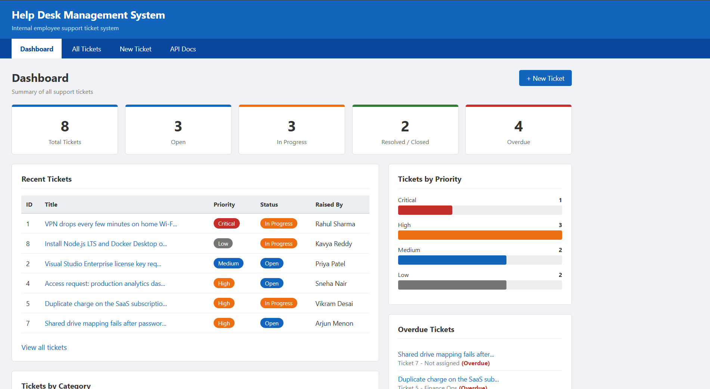

The dashboard provides an overview of the help desk with summary cards, category and priority charts, recently created tickets and overdue tickets.

---

### All Tickets

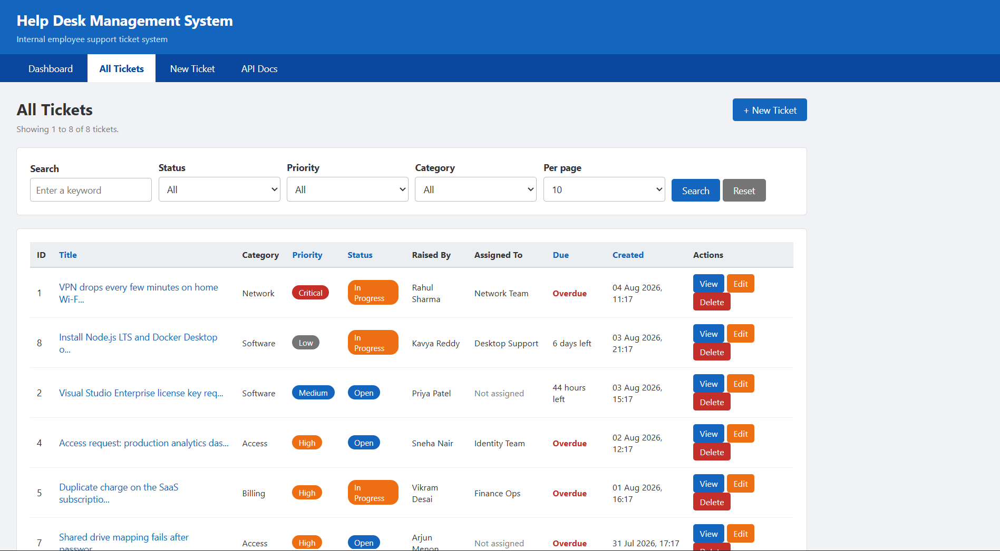

Displays every ticket with search, filtering, sorting, pagination and page size controls. All filter state is preserved in the URL for easy sharing.

---

### Filtered Ticket List

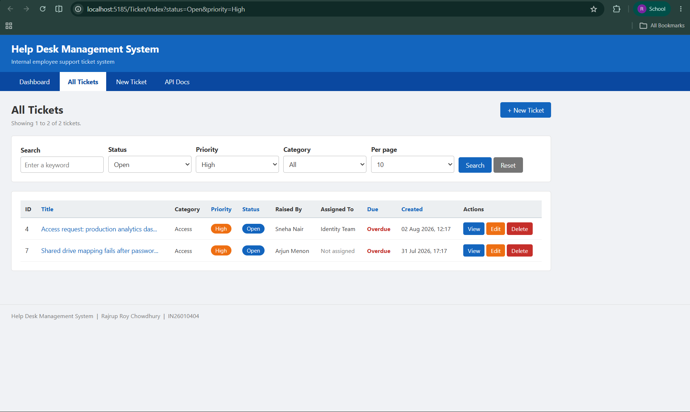

Shows the ticket list after applying status and priority filters.

---

### Ticket Details

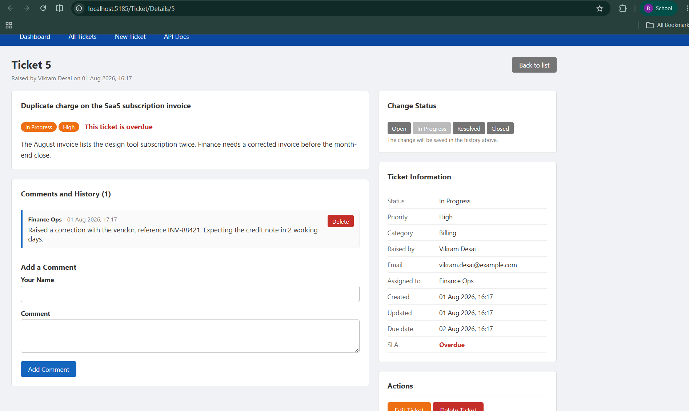

Shows complete ticket information, activity history, comments, SLA status and quick workflow actions.

---

### Create Ticket

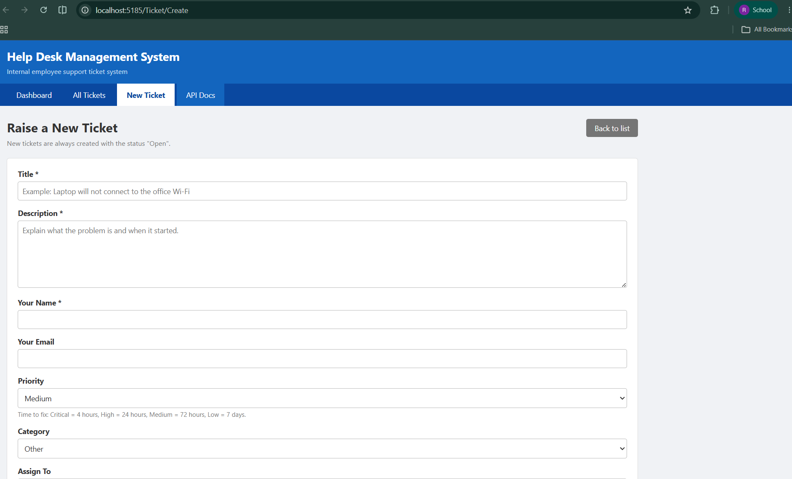

Allows users to create a new support ticket with client-side and server-side validation.

---

### Validation

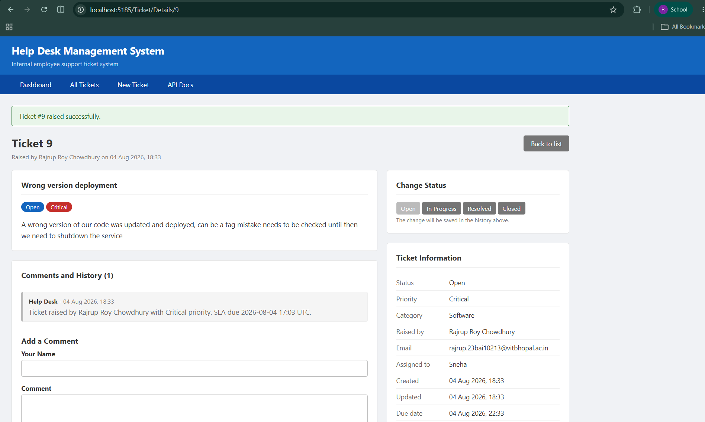

Displays validation errors when required fields are missing or invalid.

---

### Edit Ticket

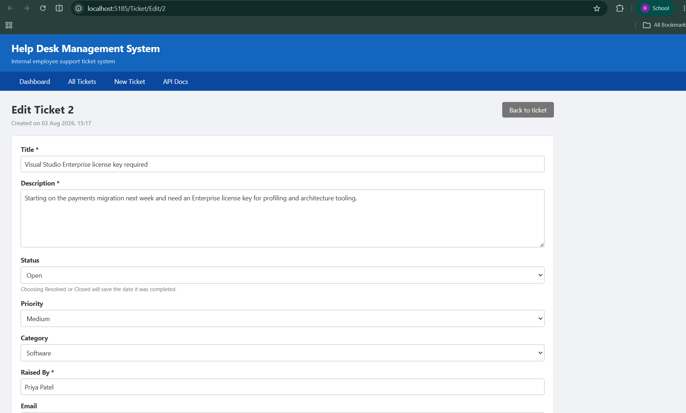

Allows authorized users to modify ticket details such as priority, category, assignment and description.

---

### Delete Confirmation

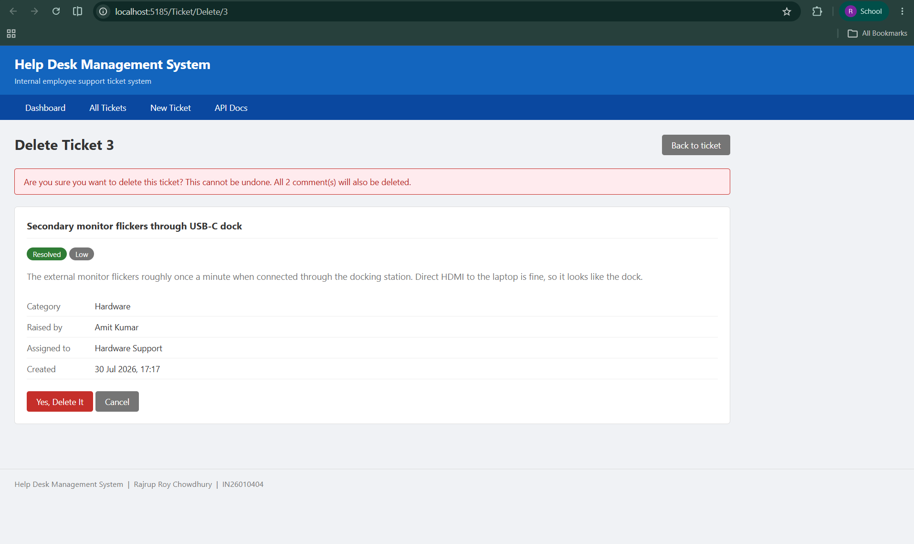

Displays a confirmation page before permanently deleting a ticket.

---

### Database

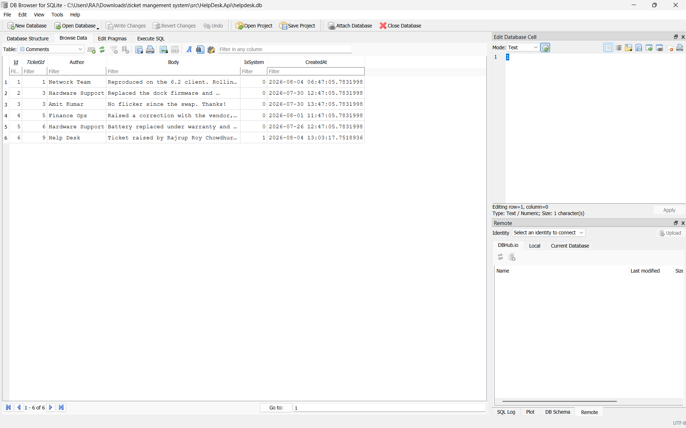

SQLite database containing the seeded ticket records.

---

### Test Results

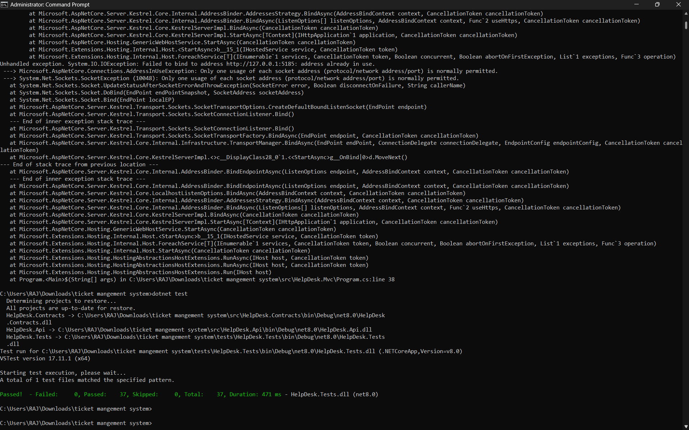

Successful execution of the project's automated test suite.

---

### API Documentation (Swagger)

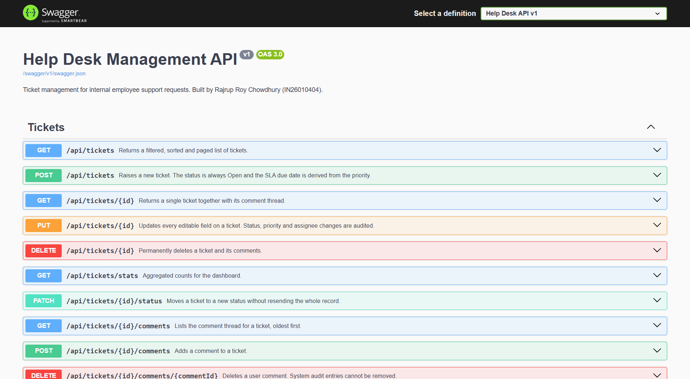

Interactive REST API documentation generated by Swagger/OpenAPI.

## 📁 Repository Structure

| Folder | Purpose |
|--------|---------|
| 📂 `src/HelpDesk.Api` | REST API, EF Core, repositories and business logic |
| 📂 `src/HelpDesk.Contracts` | Shared DTOs, enums and validation rules |
| 📂 `src/HelpDesk.Mvc` | ASP.NET Core MVC frontend using HttpClient |
| 📂 `tests/HelpDesk.Tests` | xUnit unit tests |
| 📂 `screenshots` | UI screenshots used in this README |
| 📄 `DEPLOYMENT.md` | Deployment instructions |
| 📄 `HelpDesk_Assignment_Report.pdf` | Complete project report |
| 📄 `README.md` | Project documentation |

## Architecture

```
                    HTTP/JSON
  Browser  ──────►  HelpDesk.Mvc  ──────────►  HelpDesk.Api  ──────►  SQLite / SQL Server
                    (Razor views)              (REST + EF Core)
                          │                          │
                          └──────────┬───────────────┘
                                     ▼
                             HelpDesk.Contracts
                        (enums, DTOs, validation rules)
```

| Project | Role |
| --- | --- |
| `src/HelpDesk.Contracts` | Enums, request/response DTOs, query options and the DataAnnotations validation rules. Referenced by **both** other projects, so the client and server can never drift apart. |
| `src/HelpDesk.Api` | REST API. Controller → Service (business rules) → Repository (EF Core) → DbContext. Swagger UI, health check, global exception handler. |
| `src/HelpDesk.Mvc` | Server-rendered UI. Controller → typed `HttpClient` API client → Razor views. No database access. |
| `tests/HelpDesk.Tests` | 37 xUnit tests over the service and repository layers, running against a real in-memory SQLite database. |

**Request flow for "raise a ticket":**
`Create.cshtml` → `TicketController.Create` → `TicketApiClient.CreateTicketAsync` →
`POST /api/tickets` → `TicketsController.CreateTicket` → `TicketService.CreateTicketAsync`
(applies the SLA, forces status to Open, writes the audit comment) → `TicketRepository.AddAsync`
→ database.

---

## Features

### Ticket management
- Full CRUD with server-side validation on every field.
- New tickets are **always** created `Open` — the create DTO has no status field, so a client
  cannot open an already-closed ticket.
- Six categories, four priorities, four workflow states.
- Assignment to a team or agent, with an "unassigned queue" filter.

### SLA tracking
- The resolution deadline is derived from the priority: **Critical 4 h · High 24 h · Medium 72 h ·
  Low 7 days**, defined once in `SlaPolicy` so the seeder, the API and the tests cannot disagree.
- Changing a priority re-derives the deadline from the original creation time; an explicit deadline
  always wins.
- Overdue tickets are highlighted in the table, counted on the dashboard and filterable.

### Activity trail
- Every status, priority and assignment change writes a system comment naming the actor.
- Agents and requesters can add their own comments; system entries cannot be deleted.

### Search and reporting
- Free-text search across title, description, requester and assignee, with LIKE wildcards escaped
  so searching for `50%` does not match every row.
- Filter by status, priority, category, assignee and SLA breach; sort by six fields in either
  direction; page sizes of 10/25/50/100 with the page size clamped server-side.
- `/api/tickets/stats` powers the dashboard: status and priority breakdowns, overdue and unassigned
  counts, mean resolution hours and a 7-day intake trend (the last is returned by the API for
  reporting use; the dashboard currently shows the category and priority breakdowns).

### Engineering
- Enums serialise as readable strings (`"InProgress"`) and are stored as text in the database.
- All timestamps are UTC end-to-end, with EF value converters re-stamping `DateTimeKind` on read
  (neither SQLite nor SQL Server persists it) and the UI rendering local time.
- Unhandled exceptions become RFC 7807 `ProblemDetails`; stack traces are only exposed in Development.
- `/health` reports database connectivity.

---

## Quick start

**Prerequisite:** [.NET 8 SDK](https://dotnet.microsoft.com/download/dotnet/8.0). Nothing else —
the default database is SQLite and the file is created and seeded on first run.

### Option 1 — one command (Windows)

```powershell
.\run.ps1
```

Builds the solution, starts the API, waits for it to report healthy, starts the UI and opens
a browser.

### Option 2 — two terminals (any OS)

Terminal 1 — the API:

```bash
dotnet run --project src/HelpDesk.Api --urls http://localhost:5285
```

Terminal 2 — the web UI:

```bash
dotnet run --project src/HelpDesk.Mvc --urls http://localhost:5185
```

### Option 3 — Docker

```bash
docker compose up --build
```

| | URL |
| --- | --- |
| Web UI | <http://localhost:5185> (Docker: <http://localhost:8080>) |
| Swagger UI | <http://localhost:5285/swagger> (Docker: <http://localhost:8081/swagger>) |
| Health check | <http://localhost:5285/health> |

> **Start the API first.** If the UI cannot reach it you get a clear "API unavailable" page telling
> you exactly which command to run — not an empty ticket list pretending the database is empty.

The database seeds eight realistic tickets on first run (including one deliberately past its SLA so
the overdue features have something to show). Delete `src/HelpDesk.Api/helpdesk.db` to reset.

---

## Configuration

### API — `src/HelpDesk.Api/appsettings.json`

| Setting | Default | Notes |
| --- | --- | --- |
| `Database:Provider` | `Sqlite` | Set to `SqlServer` to use SQL Server. |
| `ConnectionStrings:DefaultConnection` | `Data Source=helpdesk.db` | |
| `Cors:AllowedOrigins` | localhost UI origins | Use `["*"]` to allow any origin. |

To use SQL Server instead:

```json
{
  "Database": { "Provider": "SqlServer" },
  "ConnectionStrings": {
    "DefaultConnection": "Server=.\\SQLEXPRESS;Database=HelpDeskDb;Trusted_Connection=True;TrustServerCertificate=True"
  }
}
```

### UI — `src/HelpDesk.Mvc/appsettings.json`

| Setting | Default |
| --- | --- |
| `ApiSettings:BaseUrl` | `http://localhost:5285/` |

Every setting can be overridden with an environment variable using `__` for nesting, e.g.
`ApiSettings__BaseUrl=https://api.example.com/`.

---

## API reference

Base path `/api/tickets`. Interactive docs at `/swagger`.

| Method | Route | Purpose |
| --- | --- | --- |
| `GET` | `/api/tickets` | Filtered, sorted, paged list. |
| `GET` | `/api/tickets/{id}` | One ticket plus its comment thread. |
| `GET` | `/api/tickets/stats` | Dashboard aggregates. |
| `POST` | `/api/tickets` | Raise a ticket → `201` + `Location`. |
| `PUT` | `/api/tickets/{id}` | Update every editable field. |
| `PATCH` | `/api/tickets/{id}/status` | Move status without resending the record. |
| `DELETE` | `/api/tickets/{id}` | Delete a ticket and its comments → `204`. |
| `GET` | `/api/tickets/{id}/comments` | Comment thread, oldest first. |
| `POST` | `/api/tickets/{id}/comments` | Add a comment → `201`. |
| `DELETE` | `/api/tickets/{id}/comments/{commentId}` | Delete a user comment → `204`. |
| `GET` | `/health` | Liveness + database check. |

**Query parameters on the list endpoint:** `search`, `status`, `priority`, `category`,
`assignedTo` (or the literal `unassigned`), `overdueOnly`, `sortBy`
(`CreatedAt|UpdatedAt|DueDate|Priority|Status|Title`), `sortDir` (`Asc|Desc`), `page`, `pageSize`.

```bash
# Open, critical-first, breaching their SLA
curl "http://localhost:5285/api/tickets?status=Open&overdueOnly=true&sortBy=Priority&sortDir=Asc"

# Raise a ticket
curl -X POST http://localhost:5285/api/tickets \
  -H "Content-Type: application/json" \
  -d '{"title":"Laptop will not boot","description":"Blue screen on startup since the update.","priority":"High","category":"Hardware","raisedBy":"Rajrup Roy Chowdhury"}'
```

---

## Testing

```bash
dotnet test
```

37 tests covering SLA derivation, status-transition side effects, the audit trail, cascade delete,
system-comment protection, statistics, LIKE-wildcard escaping, severity-ordered sorting, paging
boundaries and UTC round-tripping. They run against a real in-memory SQLite database rather than the
EF in-memory provider, so the LINQ translations and value converters are genuinely exercised.

There is also `docs/verify-api.py`, an end-to-end script that asserts 53 behaviours against a
running API:

```bash
dotnet run --project src/HelpDesk.Api --urls http://localhost:5285   # terminal 1
python docs/verify-api.py                                            # terminal 2
```

---

## Deployment

See **[DEPLOYMENT.md](DEPLOYMENT.md)** for step-by-step instructions covering IIS, Azure App
Service, Linux + systemd + Nginx, Docker and Render.

---

## Improvements over the reference project

Built with [HelpDeskManagement_IN26012154](https://github.com/Akhil-astitva365/HelpDeskManagement_IN26012154)
as a starting reference. The structural changes:

| Area | Reference | This project |
| --- | --- | --- |
| **Validation** | No attributes on the model, so `ModelState.IsValid` was always true and any input was accepted | DataAnnotations on shared DTOs, enforced on the client *and* the server |
| **Model sharing** | `Ticket` class duplicated in both projects — free to drift | One `HelpDesk.Contracts` project referenced by both |
| **Over-posting** | Entity bound directly from the request body | Separate create/update DTOs; create has no `Status` field at all |
| **Type safety** | Magic strings for status and priority | Enums, serialised as strings, stored as text |
| **Error handling** | Client caught every exception and returned an empty list — a dead API looked like an empty database | Typed exception, dedicated "API unavailable" page, RFC 7807 responses |
| **Setup** | Required SQL Server Express | SQLite by default (zero setup), SQL Server via one config switch |
| **Querying** | List everything, filter by status only | Search, five filters, six sort fields, pagination |
| **Sorting** | — | Priority and status sort by real severity/workflow order, not alphabetically by the stored text |
| **Time** | `DateTime.Now`, kind lost on round-trip | UTC end-to-end, value converters restore `Kind`, UI renders local time |
| **Domain** | Title, description, priority, status, requester | Adds categories, assignment, SLA deadlines, resolution timestamps, comment threads and an audit trail |
| **Reporting** | Three counters | Stats endpoint, summary cards and bar charts, overdue and unassigned tracking, mean resolution time |
| **UI** | Default Bootstrap with empty, uncoloured badges | Colour-coded status and priority labels, summary cards, bar charts, empty states, success/error messages |
| **Testing** | None | 37 unit tests + 53 end-to-end assertions |
| **Ops** | — | Health check, Swagger, Dockerfiles, compose file, deployment guide |

---

## Known environment issue: Smart App Control

If you see:

```
Could not load file or assembly '...dll'. An Application Control policy has blocked this file. (0x800711C7)
```

Windows **Smart App Control** is blocking locally-built, unsigned assemblies. It is most aggressive
about files under `Downloads`.

**Fix — move the project out of `Downloads`:**

```powershell
Move-Item "$env:USERPROFILE\Downloads\ticket mangement system" "$env:USERPROFILE\source\repos\HelpDesk"
```

then delete the stale `bin`/`obj` folders and rebuild:

```powershell
Get-ChildItem -Recurse -Directory -Include bin,obj | Remove-Item -Recurse -Force
dotnet build
```

Running under Docker also sidesteps it entirely. If `dotnet test` still reports
*"An Application Control policy has blocked this file"*, Smart App Control is blocking the test
host specifically; you can check its state with

```powershell
Get-ItemProperty 'HKLM:\SYSTEM\CurrentControlSet\Control\CI\Policy' | Select VerifiedAndReputablePolicyState
```

where `0` is off, `1` is enforced and `2` is evaluation mode. Turning it off is a one-way change
(re-enabling needs a Windows reset), so it is your call whether to do so — the application itself
runs fine once the project lives outside `Downloads`.
